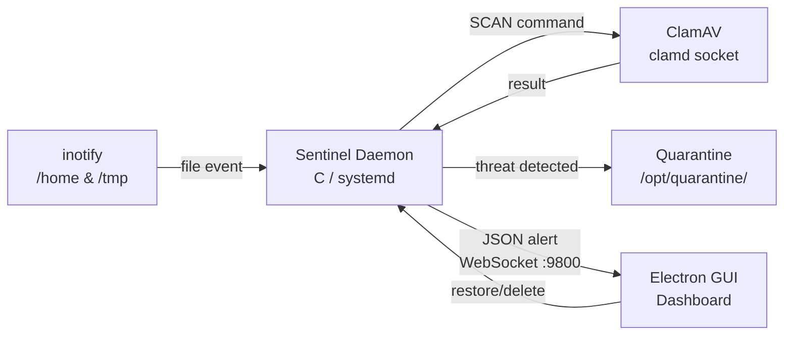

# 🛡️ Sentinel — Next-Gen Endpoint Security & Quarantine Tool

A real-time file-monitoring daemon and security dashboard for Ubuntu Linux. Sentinel watches your filesystem for new and modified files, scans them instantly via ClamAV, and quarantines threats — all with a modern dark-themed Electron GUI.

---

## Architecture



### Components

| Component | Language | Description |
|-----------|----------|-------------|
| **Daemon** (`daemon/`) | C | Systemd service — inotify watcher, ClamAV scanner, quarantine manager, WebSocket server |
| **GUI** (`gui/`) | Node.js / Electron | Dark-themed dashboard — real-time scan log, threat vault, live stats |
| **Install Script** (`scripts/`) | Bash | One-click dependency installer for Ubuntu |

---

## Features

- **Real-Time Monitoring** — `inotify` watches `/home` and `/tmp` recursively for `IN_CLOSE_WRITE` and `IN_CREATE` events
- **Instant Scanning** — Files are sent to ClamAV's `clamd` daemon via UNIX socket before the user can execute them
- **Quarantine Protocol** — Infected files are immediately `chmod 000`'d and moved to `/opt/quarantine/`
- **JSON Manifest** — Quarantined files tracked in a JSON manifest for restore/delete operations
- **Live Dashboard** — Electron GUI with WebSocket connection shows real-time scan log and threat vault
- **Restore & Delete** — Manage quarantined files directly from the GUI
- **Graceful Lifecycle** — Proper signal handling, auto-reconnect, and systemd integration

---

## Directory Structure

```
├── daemon/
│   ├── Makefile
│   ├── sentinel.service          # systemd unit file
│   ├── include/
│   │   ├── alert.h               # WebSocket alert server API
│   │   ├── logger.h              # Dual logging API (syslog + file)
│   │   ├── monitor.h             # inotify file watcher API
│   │   ├── quarantine.h          # Quarantine management API
│   │   └── scanner.h             # ClamAV clamd scanner API
│   └── src/
│       ├── alert.c               # libwebsockets server implementation
│       ├── logger.c              # syslog + rotating file logger
│       ├── main.c                # Daemon entry point & event loop
│       ├── monitor.c             # Recursive inotify watcher
│       ├── quarantine.c          # chmod 000, move, manifest tracking
│       └── scanner.c             # ClamAV UNIX socket scanner
├── gui/
│   ├── main.js                   # Electron main process
│   ├── package.json
│   ├── preload.js                # Secure context bridge
│   └── renderer/
│       ├── index.html            # Dashboard layout
│       ├── renderer.js           # UI logic
│       └── style.css             # Dark theme styling
└── scripts/
    └── install_deps.sh           # Ubuntu dependency installer
```

---

## Quick Start

### 1. Install Dependencies

```bash
sudo bash scripts/install_deps.sh
```

This installs: `build-essential`, `libwebsockets-dev`, `libjson-c-dev`, `clamav`, `clamav-daemon`, `nodejs`

### 2. Build the Daemon

```bash
cd daemon
make
sudo make install
```

### 3. Start the Service

```bash
sudo systemctl start sentinel
sudo systemctl status sentinel
```

### 4. Launch the GUI

```bash
cd gui
npm install
npm start
```

---

## Testing with EICAR

Download the [EICAR test file](https://www.eicar.org/download-anti-malware-testfile/) to trigger a detection:

```bash
curl -o /tmp/eicar_test.txt https://secure.eicar.org/eicar.com.txt
```

The daemon will detect, quarantine, and push an alert to the GUI.

---

## Configuration

| Setting | Default | Location |
|---------|---------|----------|
| Watch directories | `/home`, `/tmp` | `daemon/src/main.c` |
| WebSocket port | `9800` | `daemon/include/alert.h` |
| Quarantine dir | `/opt/quarantine/` | `daemon/include/quarantine.h` |
| Log file | `/var/log/sentinel.log` | `daemon/include/logger.h` |
| ClamAV socket | `/var/run/clamav/clamd.ctl` | `daemon/include/scanner.h` |

---

## Requirements

- Ubuntu 20.04+ (or Debian-based)
- ClamAV daemon (`clamd`)
- libwebsockets (`libwebsockets-dev`)
- json-c (`libjson-c-dev`)
- Node.js 18+ and npm
- Root privileges (for daemon)

---

## License

MIT © [CS-Fasih](https://github.com/CS-Fasih)
